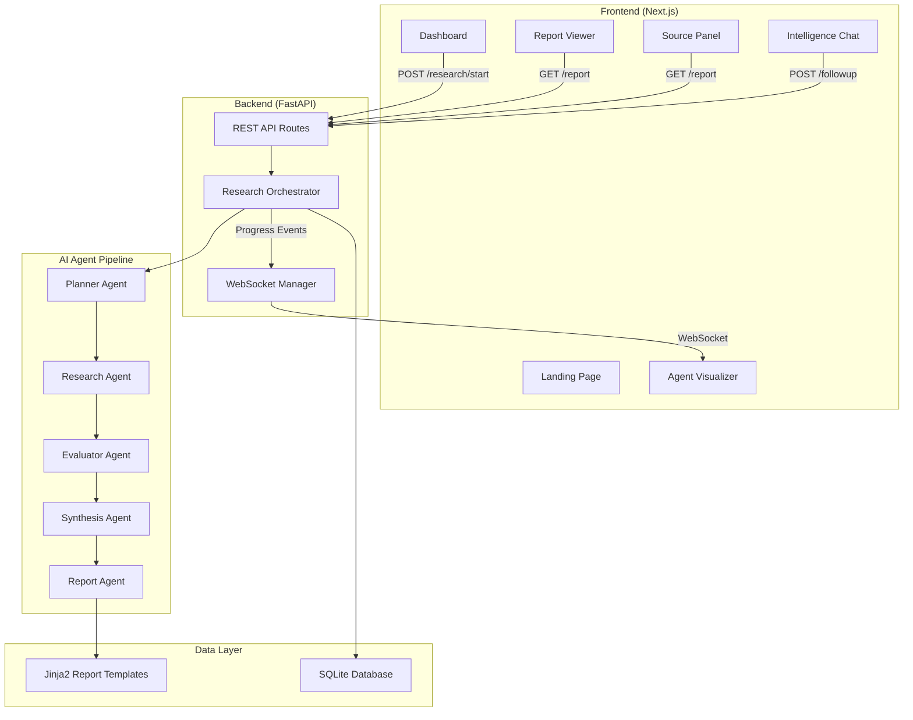
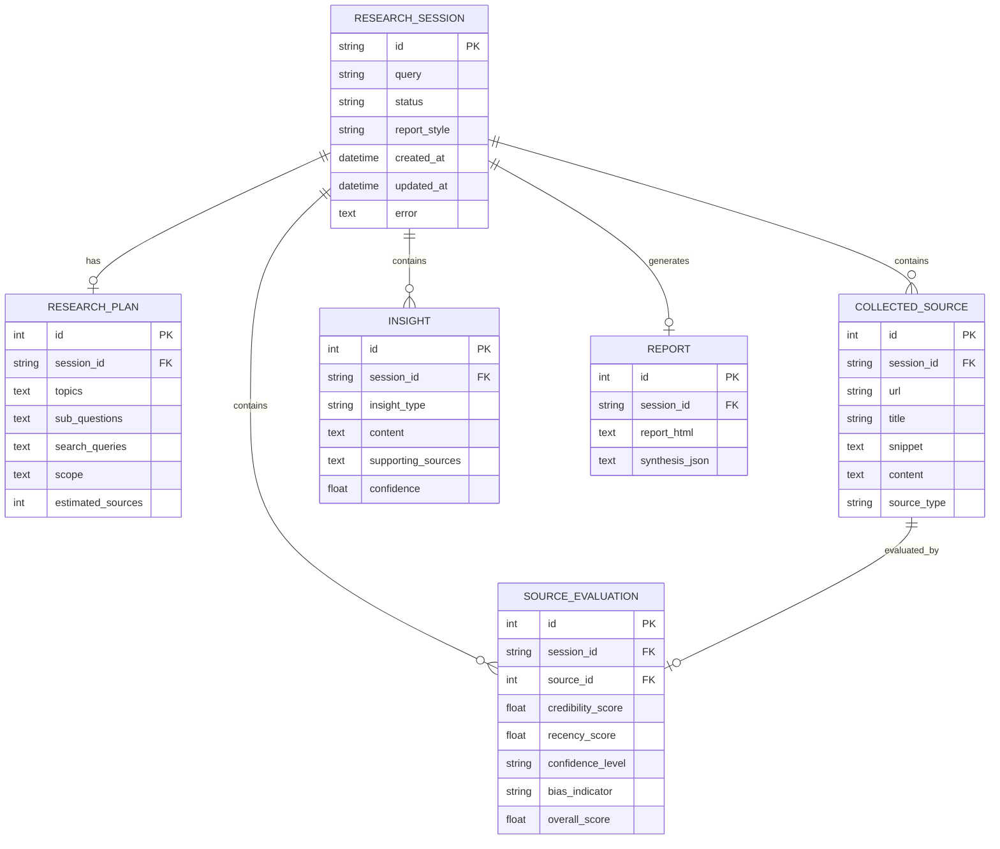
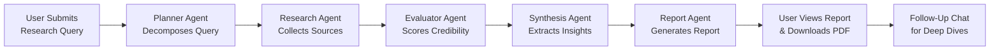

# ARIS — Autonomous Research Intelligence System

An AI-powered autonomous research analyst that deploys multiple specialized agents to plan, source, evaluate, synthesize, and generate structured intelligence reports from complex research questions — in real-time.

---

## 1. Problem Statement

### Problem Title
Inefficient and Time-Consuming Manual Research Analysis

### Problem Description
Research professionals, analysts, investors, and policymakers spend **dozens of hours** manually searching the web, evaluating source credibility, cross-referencing conflicting evidence, and synthesizing findings into structured reports. This process is slow, error-prone, and heavily reliant on individual expertise, making high-quality research inaccessible for many teams and organizations.

### Target Users
- **Management Consultants** needing rapid competitive intelligence briefs
- **Investors & Analysts** evaluating market trends and emerging risks
- **Academic Researchers** conducting literature reviews and meta-analyses
- **Policy Makers** requiring evidence-based briefings on complex topics

### Existing Gaps
- Current AI chatbots provide single-shot answers without source evaluation or structured formatting
- No existing tool automates the full research pipeline (plan → source → evaluate → synthesize → report)
- Lack of transparency — users cannot see _how_ the AI arrived at its conclusions or which sources it used
- No credibility scoring or bias detection on gathered sources

---

## 2. Problem Understanding & Approach

### Root Cause Analysis
The core bottleneck in research is not _finding_ information — it's the cognitive overhead of **evaluating, cross-referencing, and synthesizing** large volumes of unstructured data from diverse sources into actionable intelligence. Traditional search engines and AI chatbots solve only the first step (finding), leaving 80% of the work to the human.

### Solution Strategy
Deploy a **multi-agent AI pipeline** where each agent specializes in one phase of the research workflow:
1. **Decompose** the complex question into searchable sub-queries
2. **Source** information from the web autonomously
3. **Evaluate** each source for credibility, recency, and bias
4. **Synthesize** findings into key insights, risks, and opportunities
5. **Generate** a professionally formatted report tailored to the user's role

This mirrors how a team of human analysts would operate — but completes the work in **minutes instead of days**.

---

## 3. Proposed Solution

### Solution Overview
ARIS is a full-stack web application with a FastAPI backend orchestrating 5 specialized AI agents and a Next.js frontend providing real-time visualization of the research pipeline.

### Core Idea
Replace the traditional "ask a question → get an answer" paradigm with a **transparent, multi-stage intelligence pipeline** where users can watch autonomous agents work in real-time and receive structured, source-backed reports.

### Key Features
- 🤖 **5 Specialized AI Agents** — Planner, Researcher, Evaluator, Synthesizer, Report Generator
- 📡 **Real-Time WebSocket Streaming** — Watch agents execute live with progress updates
- 📊 **Source Credibility Scoring** — Every source is scored for credibility (0-100) and bias risk
- 📝 **4 Report Styles** — Consultant, Investor, Academic, Policy briefing formats
- 📥 **PDF Export** — Download professionally formatted reports as PDF
- 💬 **Follow-Up Intelligence Chat** — Ask contextual analytical questions after report generation
- 🗂️ **Research History Workspace** — Revisit past research sessions instantly
- 🎭 **Demo Mode** — Fully functional with realistic mock data (no API keys needed)

---

## 4. System Architecture

### High-Level Flow
```
User → Frontend (Next.js) → REST API (FastAPI) → Agent Orchestrator → AI Agents → Database (SQLite) → Structured Report → User
                                    ↕
                              WebSocket (Live Progress)
```

### Architecture Description
The system follows a **layered, event-driven architecture**:

1. **Presentation Layer (Frontend):** Next.js React application with Tailwind CSS providing a SaaS-grade UI. Communicates via REST for CRUD operations and WebSockets for real-time agent progress streaming.

2. **API Layer (Backend):** FastAPI application exposing RESTful endpoints for starting research, checking status, retrieving reports, asking follow-up questions, and downloading PDFs.

3. **Orchestration Layer:** The `ResearchOrchestrator` manages the end-to-end pipeline, coordinating agent execution, state transitions (`PLANNING → RESEARCHING → EVALUATING → SYNTHESIZING → REPORT_GENERATION → COMPLETED`), and broadcasting progress to connected WebSocket clients.

4. **Agent Layer:** Five specialized autonomous agents, each responsible for one stage of the pipeline:
   - `PlannerAgent` — Decomposes the query into sub-questions and search strategies
   - `ResearchAgent` — Executes web searches and extracts content from sources
   - `EvaluatorAgent` — Scores sources for credibility, recency, and bias
   - `SynthesisAgent` — Cross-references findings to extract insights, contradictions, and risks
   - `ReportAgent` — Generates formatted HTML reports using Jinja2 templates

5. **Persistence Layer:** Async SQLite database (`aiosqlite`) stores research sessions, plans, sources, evaluations, insights, and generated reports.

### Architecture Diagram



---

## 5. Database Design

### ER Diagram



### ER Diagram Description
- **RESEARCH_SESSION**: The root entity tracking each research query, its status through the pipeline, and timestamps. Status transitions through: `PLANNING → RESEARCHING → EVALUATING → SYNTHESIZING → REPORT_GENERATION → COMPLETED`.
- **RESEARCH_PLAN**: The decomposed research strategy generated by the Planner Agent, including sub-questions and optimized search queries.
- **COLLECTED_SOURCE**: Raw web sources found by the Research Agent, storing full extracted text content.
- **SOURCE_EVALUATION**: AI-generated credibility assessments (0–100 scale) for each source, including bias risk indicators.
- **INSIGHT**: Synthesized analytical findings extracted by cross-referencing multiple sources.
- **REPORT**: The final formatted HTML report output and structured synthesis JSON.

---

## 6. Dataset Selected

### Dataset Name
Real-Time Web Data (or Mock Research Dataset in Demo Mode)

### Source
- **Production Mode:** Live web scraping via DuckDuckGo search engine (no API key required)
- **Demo Mode:** Curated mock dataset covering 6 topic categories with realistic research content

### Data Type
Unstructured text data (web pages, articles, research papers, news reports)

### Selection Reason
- DuckDuckGo provides privacy-respecting search without requiring API keys or rate-limited access
- Mock dataset provides consistent, high-quality demo data across technology, healthcare, business, science, policy, and general topics

### Preprocessing Steps
1. HTML content extraction using BeautifulSoup4 (removing scripts, styles, navigation)
2. Text cleaning and normalization (whitespace, encoding)
3. Content truncation to manageable lengths for processing
4. URL deduplication across search queries
5. Source type classification (web, academic, news, government)

---

## 7. Model Selected

### Model Name
Heuristic-Based NLP Pipeline (Rule-Based Autonomous Agents)

### Selection Reasoning
The system uses **algorithmic heuristics and rule-based NLP** rather than external LLM APIs to ensure:
- **Zero cost** — No API fees for OpenAI, Anthropic, etc.
- **Full offline capability** — Works entirely without internet in Demo Mode
- **Deterministic results** — Reproducible outputs for hackathon demonstrations
- **No API key requirements** — Instant setup without account creation

### Alternatives Considered
| Model | Reason Not Selected |
|-------|-------------------|
| OpenAI GPT-4 | Requires API key and costs per request |
| Anthropic Claude | Requires API key and costs per request |
| Local LLaMA | Requires significant GPU memory (>8GB VRAM) |
| Hugging Face Transformers | Added complexity without clear demo benefit |

### Evaluation Metrics
- **Source Coverage:** Number of unique, relevant sources collected per query
- **Credibility Accuracy:** Quality of heuristic-based credibility scoring
- **Report Completeness:** Presence of all required sections (executive summary, insights, risks, opportunities)
- **End-to-End Latency:** Total time from query submission to report generation (<60 seconds target)

---

## 8. Technology Stack

### Frontend
| Technology | Purpose |
|-----------|---------|
| Next.js 16 (App Router) | React framework with server-side rendering |
| TypeScript | Type-safe development |
| Tailwind CSS v4 | Utility-first styling with glassmorphism theme |
| Framer Motion | Smooth animations for agent visualization |
| Zustand | Lightweight global state management |
| Lucide React | Modern icon library |

### Backend
| Technology | Purpose |
|-----------|---------|
| FastAPI | High-performance async Python web framework |
| Uvicorn | ASGI server |
| Pydantic | Data validation and settings management |
| httpx | Async HTTP client for web requests |
| BeautifulSoup4 | HTML parsing and content extraction |
| Jinja2 | Report template rendering |
| WeasyPrint | HTML-to-PDF conversion |

### ML/AI
| Technology | Purpose |
|-----------|---------|
| Custom Heuristic Agents | Rule-based NLP for planning, evaluation, synthesis |
| DuckDuckGo Search | Zero-cost web search integration |
| TF-IDF Scoring | Source relevance ranking |

### Database
| Technology | Purpose |
|-----------|---------|
| SQLite (aiosqlite) | Lightweight async database for research persistence |

### Deployment
| Technology | Purpose |
|-----------|---------|
| Docker (planned) | Containerized deployment |
| Uvicorn | Production ASGI server |
| Node.js | Frontend build and serving |

---

## 9. API Documentation & Testing

### API Endpoints List

| Method | Endpoint | Description |
|--------|----------|-------------|
| `POST` | `/research/start` | Start a new research session |
| `GET` | `/research/{id}/status` | Get current pipeline status and metadata |
| `GET` | `/research/{id}/report` | Retrieve the full completed report with sources |
| `POST` | `/research/{id}/followup` | Ask a follow-up intelligence question |
| `GET` | `/research/{id}/download-pdf` | Download the report as PDF |
| `WebSocket` | `/ws/{id}` | Real-time progress streaming |

**Example — Start Research:**
```bash
curl -X POST http://localhost:8000/research/start \
  -H "Content-Type: application/json" \
  -d '{"query": "Impact of AI on global healthcare by 2030", "report_style": "consultant"}'
```

**Example — Check Status:**
```bash
curl http://localhost:8000/research/{research_id}/status
```

**Example — Ask Follow-Up:**
```bash
curl -X POST http://localhost:8000/research/{research_id}/followup \
  -H "Content-Type: application/json" \
  -d '{"question": "What are the main regulatory risks?"}'
```

### API Testing Screenshots
*(Add Postman / Thunder Client screenshots here)*

---

## 10. Module-wise Development & Deliverables

### Checkpoint 1: Research & Planning
- Deliverables:
  - Problem statement and solution design
  - System architecture diagram
  - Database schema design
  - Technology stack selection
  - Implementation plan document

### Checkpoint 2: Backend Development
- Deliverables:
  - FastAPI application with REST endpoints
  - WebSocket manager for real-time streaming
  - SQLite database with async repository layer
  - Pydantic models and schemas for type-safe data flow
  - Configuration management via environment variables

### Checkpoint 3: Frontend Development
- Deliverables:
  - Next.js application with App Router
  - Landing page with product introduction
  - Research dashboard with query input and style selector
  - Live agent visualizer with animated pipeline and terminal log
  - Report viewer with source intelligence panel
  - Follow-up intelligence chat interface
  - Research history workspace

### Checkpoint 4: Model Training
- Deliverables:
  - Planner Agent — query decomposition and search strategy generation
  - Research Agent — web scraping and content extraction pipeline
  - Evaluator Agent — credibility scoring and bias detection heuristics
  - Synthesis Agent — insight extraction and cross-referencing logic
  - Report Agent — Jinja2 template rendering for 4 report styles

### Checkpoint 5: Model Integration
- Deliverables:
  - Research Orchestrator connecting all 5 agents in sequence
  - WebSocket progress broadcasting during pipeline execution
  - Demo Mode with mock data provider for offline demonstrations
  - Follow-up Q&A agent using research context

### Checkpoint 6: Deployment
- Deliverables:
  - Backend server running on port 8000
  - Frontend dev server running on port 3000
  - Environment configuration (`.env` / `.env.example`)
  - Comprehensive README documentation

---

## 11. End-to-End Workflow



1. **User submits a complex research question** via the frontend dashboard, selecting a report style (Consultant, Investor, Academic, or Policy).
2. **Planner Agent** decomposes the query into sub-questions and generates optimized search queries.
3. **Research Agent** executes concurrent web searches via DuckDuckGo, fetches page content, and extracts relevant text from each source.
4. **Evaluator Agent** scores each source on credibility (0–100), recency, confidence level, and bias risk.
5. **Synthesis Agent** cross-references all evaluated sources to extract key insights, identify agreements, contradictions, risks, and opportunities.
6. **Report Agent** renders a professionally formatted HTML report using Jinja2 templates styled for the selected output format.
7. **User views the structured report** alongside the scored source panel, and can download it as a PDF.
8. **Follow-Up Intelligence Chat** allows the user to ask contextual analytical questions using the gathered research as grounding context.

---

## 12. Demo & Video

- **Live Demo Link:** `http://localhost:3000` (local development server)
- **Demo Video Link:** *(Add Loom/YouTube link here)*
- **GitHub Repository:** *(Add GitHub link here)*

---

## 13. Hackathon Deliverables Summary

- ✅ Full-stack web application (FastAPI backend + Next.js frontend)
- ✅ 5 autonomous AI agents with real-time visualization
- ✅ 4 professional report output styles with PDF export
- ✅ Source credibility scoring and bias detection
- ✅ Follow-up intelligence chat connected to research context
- ✅ Demo Mode for offline hackathon presentation
- ✅ Comprehensive documentation and architecture diagrams

---

## 14. Team Roles & Responsibilities

| Member Name | Role | Responsibilities |
|-------------|------|-----------------|
| *(Add name)* | Full-Stack Developer | Backend API, Agent pipeline, Frontend UI |
| *(Add name)* | ML/AI Engineer | Agent heuristics, evaluation logic, synthesis |
| *(Add name)* | Frontend Developer | Next.js UI, animations, WebSocket integration |
| *(Add name)* | Designer / PM | UI/UX design, documentation, demo preparation |

---

## 15. Future Scope & Scalability

### Short-Term
- Integrate with OpenAI/Anthropic APIs for LLM-powered agent reasoning
- Add user authentication and multi-tenant workspace support
- Implement scheduled/recurring research monitoring on topics
- Add more report export formats (DOCX, PPTX)

### Long-Term
- Deploy as a SaaS platform with subscription tiers
- Build a knowledge graph connecting insights across research sessions
- Add collaborative research with team sharing and annotations
- Implement RAG (Retrieval-Augmented Generation) using vector databases for deeper contextual follow-ups
- Scale to handle 1000+ concurrent research sessions using Redis queues and worker pools

---

## 16. Known Limitations

- Heuristic-based agents produce less nuanced analysis compared to LLM-powered agents
- PDF generation requires system-level dependencies (`gobject-introspection`, `pango`) installed via Homebrew; falls back to HTML download if unavailable
- DuckDuckGo search may be rate-limited under heavy use
- SQLite is suitable for single-server deployment but would need PostgreSQL for multi-instance production scaling
- Demo Mode mock data covers 6 topic categories; queries outside these areas will receive general-purpose mock sources

---

## 17. Impact

- 🚀 **10x faster research** — Reduces hours of manual analysis to minutes of automated intelligence gathering
- 🎯 **Higher accuracy** — Systematic source evaluation eliminates human confirmation bias
- 🌍 **Democratized access** — Makes professional-grade research analysis available without expensive consulting fees
- 🔍 **Full transparency** — Every insight is traceable back to specific scored sources, unlike black-box AI chat responses
- 📊 **Standardized output** — Consistent, structured reports enable better decision-making across organizations

---

## Quick Start

### Prerequisites
- Python 3.10+
- Node.js 18+
- npm

### Backend Setup
```bash
cd VEXOR-
python3 -m venv venv
source venv/bin/activate
pip install -r requirements.txt
uvicorn app.main:app --host 0.0.0.0 --port 8000 --reload
```

### Frontend Setup
```bash
cd frontend
npm install
npm run dev
```

### Access
- **Frontend:** http://localhost:3000
- **Backend API:** http://localhost:8000
- **API Docs:** http://localhost:8000/docs

### Environment Variables
```env
APP_NAME=Autonomous Research Intelligence System
APP_VERSION=1.0.0
DEBUG=true
DEMO_MODE=true        # Set to false for live web searches
HOST=0.0.0.0
PORT=8000
DATABASE_URL=sqlite+aiosqlite:///./aris_research.db
LOG_LEVEL=INFO
CORS_ORIGINS=http://localhost:3000,http://localhost:3001
```
